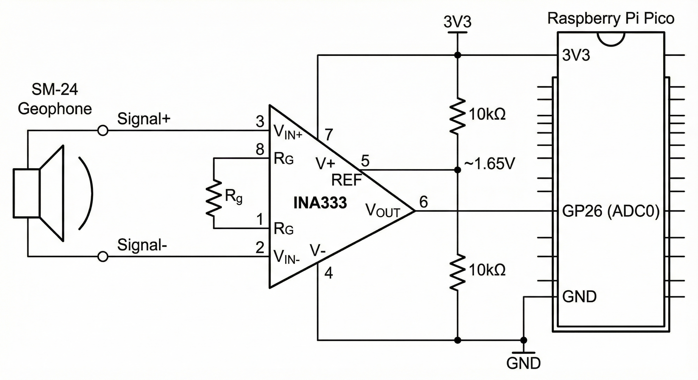
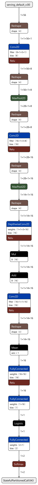

# 🌍 Seismic Sense: TinyML Earthquake Guard

**Real-time P-Wave Detection on Raspberry Pi Pico 2 using SM-24 Geophones**

> **🏆 Submission for Edge Impulse & HackerEarth Competition**
[EDGE-IMPULSE-PROJECT](https://studio.edgeimpulse.com/public/815551/live).
[PPT](Seismic-Sense-Presentation.pdf).
## 1\. Project Overview

Earthquake Early Warning (EEW) systems typically rely on expensive, government-maintained infrastructure. **Seismic Sense** democratizes this technology by bringing low-latency seismic classification to the extreme edge.

By leveraging the **Raspberry Pi Pico 2 (RP2350)** and **Edge Impulse**, this device analyzes the *frequency signature* of ground vibrations in real-time. It detects the subtle, non-destructive Primary waves (P-waves) that precede destructive S-waves, potentially providing seconds of crucial warning time.

**Key Capabilities:**

  * **Fully Offline:** No internet required for inference.
  * **Privacy-First:** Processes data on-device; no raw audio/seismic data leaves the board.
  * **Low Cost:** Total BOM \< $50 vs. professional seismographs ($1000+).

-----

## 2\. Hardware Implementation

### 2.1 Bill of Materials

| Component | Function | Notes |
| :--- | :--- | :--- |
| **Raspberry Pi Pico 2** | MCU | RP2350 (Cortex-M33) |
| **SM-24 Geophone** | Sensor | 10Hz resonance frequency |
| **TI INA333** | Amplifier | Low-noise instrumentation amp |
| **Resistors (10kΩ x2)** | Biasing | Creates 1.65V virtual ground |
| **Resistor (100Ω)** | Gain | Sets Gain \~1001x |

### 2.2 Circuit Design & Signal Conditioning

The **SM-24 Geophone** produces very low-voltage signals (millivolts) which are often too weak for the Pico 2’s ADC. Furthermore, the geophone produces an AC signal, while the ADC can only read positive voltages (0V-3.3V).

To solve this, we designed a custom **Analog Front-End (AFE)**:

**Key Circuit Features:**

1.  **Differential Amplification:** The SM-24 is connected to the $V_{IN+}$ and $V_{IN-}$ pins of the **TI INA333**. This configuration rejects common-mode noise (like mains hum), ensuring only actual ground movement is amplified.
2.  **DC Bias (Virtual Ground):** We use a voltage divider (two 10kΩ resistors) to feed **1.65V** into the `REF` pin. This lifts the geophone signal to the middle of the ADC range, allowing the Pico to read the full positive and negative swing of the wave without clipping.



## 3\. Data Strategy & DSP

### 3.1 Data Source (STEAD)

We utilize the **STEAD (STanford EArthquake Dataset)**, a global-scale dataset of labeled seismic waveforms. To adapt this research data for TinyML, we built a custom ETL pipeline:

1.  **Extraction:** Raw HDF5 waveforms were filtered for local events ($<20$km distance) with high SNR. [Extraction File](data-prep/dataset-npz.ipynb).[Uploading to Edge Impulse](data-prep/new-earthquake.ipynb).
2.  **Serialization:** Converted to **NumPy compressed archives (`.npz`)** for efficient cloud upload.
3.  **Windowing:** Sliced into windows centered on P-wave arrivals.

**Classes:**

  * `earthquake` (Distinct spectral signature of P/S waves)
  * `noise` (Background silence, footsteps, local artifacts)

### 3.2 Spectral Preprocessing (DSP)

Instead of feeding raw time-series data to the neural network, we use **Digital Signal Processing (DSP)** to extract frequency features. Earthquakes have specific frequency footprints (typically $<20$Hz) that differ from human-made noise.

  * **Input:** Raw Analog Signal (Time Domain).
  * **Process:** Fast Fourier Transform (FFT).
  * **Output:** Power Spectral Density (Frequency Domain).
  * **Input Shape to Model:** `(56, 1)` representing 56 frequency bins.

-----

## 4\. Model Architecture & Results

### 4.1 Custom 1D CNN

We implemented a custom Keras architecture optimized for the **RP2350**. It uses a "MobileNet-style" block with Depthwise Separable Convolutions to minimize parameter count and maximize inference speed.

**Design Rationale:**

  * **Conv1D on Spectrum:** The model learns to recognize specific "shapes" in the frequency spectrum (e.g., energy spikes at specific low frequencies).
  * **Depthwise Separable Conv:** Drastically reduces Multiply-Accumulate (MAC) operations, saving battery life.



### 4.2 Performance

  * **Validation Accuracy:** \~95%
  * **Inference Time (RP2350):** \~9 ms total (2ms DSP + 7ms Classification)
  * **RAM Usage:** Minimal footprint, leaving ample room for application logic.


## 5\. System Workflow (How it Works)

The system operates in a continuous loop:
`[Geophone] —(mV)→ [Amp] —(ADC)→ [DSP: FFT] —(Features)→ [Neural Net] —(Alert)`

1.  **Sensing:** The SM-24 generates a voltage proportional to ground velocity.
2.  **Digitization:** The Pico 2 samples the amplified signal at **500 Hz** into a rolling buffer.
3.  **Analysis:**
      * The buffer is passed to the Edge Impulse SDK.
      * **FFT** converts the signal to the frequency domain.
      * **CNN** classifies the spectrum.
4.  **Decision:**
      * If `earthquake` probability $> 0.8$: **Trigger Alarm** (LED Blink + GPIO HIGH).
      * Else: Continue monitoring.

5. **Source Code** [Source code file](Micro\source\main.cpp). All Hardware Implementation code is present in the directory 'Micro'.

## 6\. Installation & Deployment

### Option A: Flash Pre-compiled Firmware (Easiest)

1.  Download `firmware.uf2` from the **Releases** section of this repo.
2.  Hold the `BOOTSEL` button on your Pico 2 and plug it into USB.
3.  Drag and drop `firmware.uf2` into the `RPI-RP2` drive.

### Option B: Build from Source

1.  Clone this repository:
    ```bash
    git clone https://github.com/your-username/seismic-sense.git
    cd seismic-sense
    ```
2.  Create build directory and compile:
    ```bash
    mkdir build && cd build
    cmake ..
    make -j4
    ```
3.  Flash the resulting `.uf2` file.

### Verifying Operation

Open a serial monitor (e.g., PuTTY) at **115200 baud**. You will see the breakdown of processing time:

```text
Predictions (DSP: 2 ms, Classification: 7 ms, Anomaly: 0 ms):
    earthquake:  0.02
    noise:       0.98
```

-----

## 7\. Future Roadmap

  * **IoT Integration:** Add LoRaWAN (via Grove module) to transmit alerts to a central dashboard.
  * **Triangulation:** Network 3+ units to calculate the epicenter location.
  * **Solar Power:** Integrate a LiPo charger for autonomous remote deployment.

## 8\. References & Acknowledgements

### Code Base & Firmware

  * **Base Firmware:** [Edge Impulse Standalone Inferencing (Pico)](https://github.com/edgeimpulse/example-standalone-inferencing-pico)
      * *This project utilizes the official Edge Impulse C++ SDK wrapper for the RP2040/RP2350 as the foundation for the inference loop.*

### Dataset Citation

  * **STEAD:** Mousavi, S. M., Sheng, Y., Zhu, W., & Beroza, G. C. (2019). *STanford EArthquake Dataset (STEAD): A Global Data Set of Seismic Signals for AI*. IEEE Access. [View on GitHub](https://github.com/smousavi05/STEAD)

### Component Datasheets

  * **Raspberry Pi Pico 2 (RP2350):** [Technical Documentation](https://www.google.com/search?q=https://www.raspberrypi.com/documentation/microcontrollers/rp2350.html)
  * **SM-24 Geophone:** [SparkFun Datasheet](https://www.google.com/search?q=https://cdn.sparkfun.com/assets/d/b/6/0/3/SM-24_Datasheet.pdf)
  * **TI INA333 Amplifier:** [Texas Instruments Data Sheet](https://www.ti.com/lit/ds/symlink/ina333.pdf)

### Tools & Frameworks

  * **Edge Impulse:** [Studio & Documentation](https://docs.edgeimpulse.com/)
  * **Raspberry Pi Pico SDK:** [C/C++ SDK Repository](https://github.com/raspberrypi/pico-sdk)
